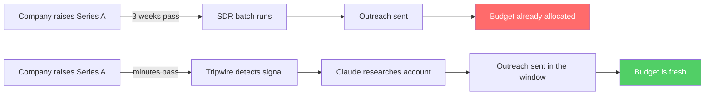
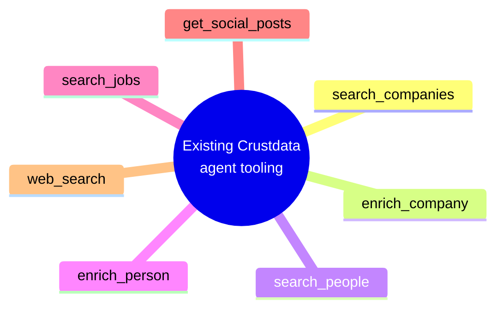
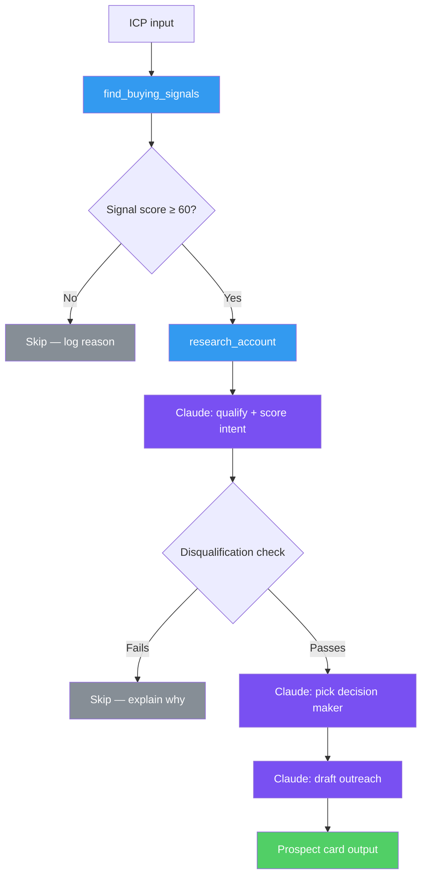
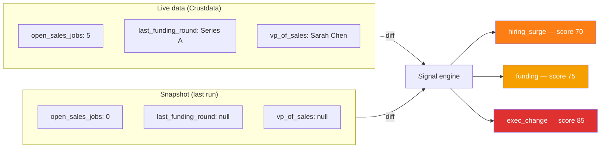
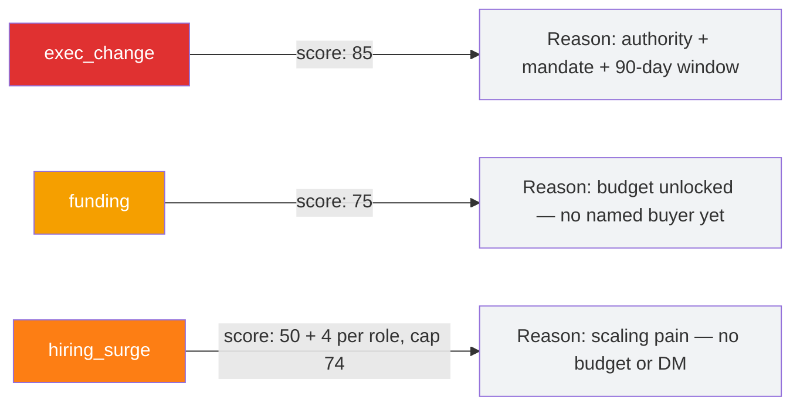
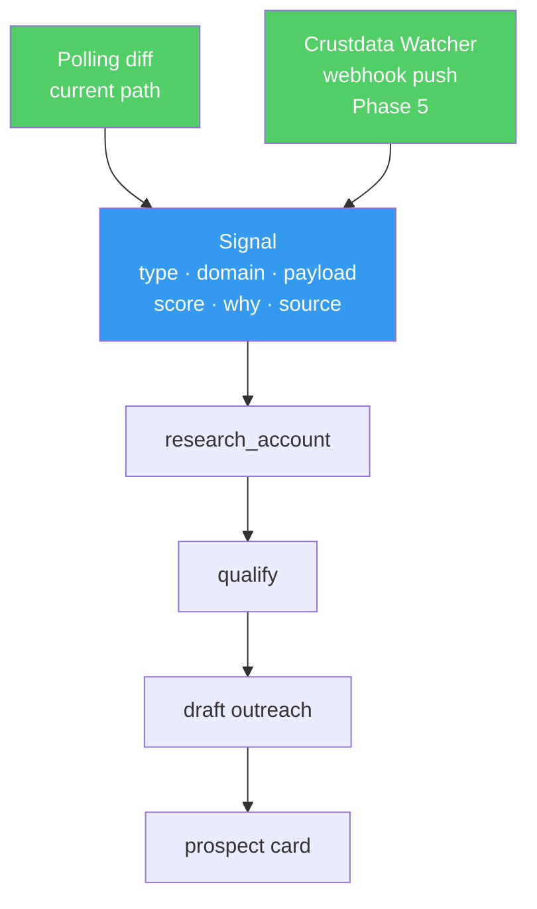
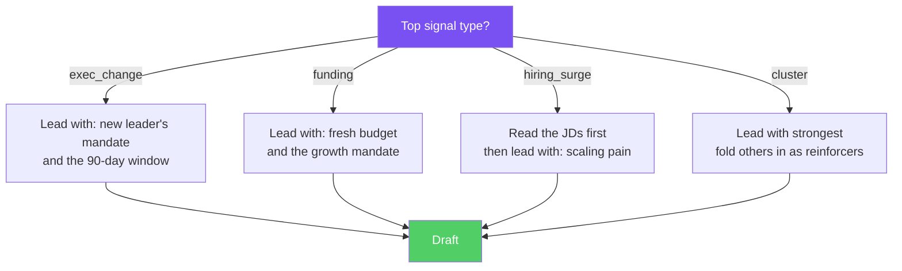
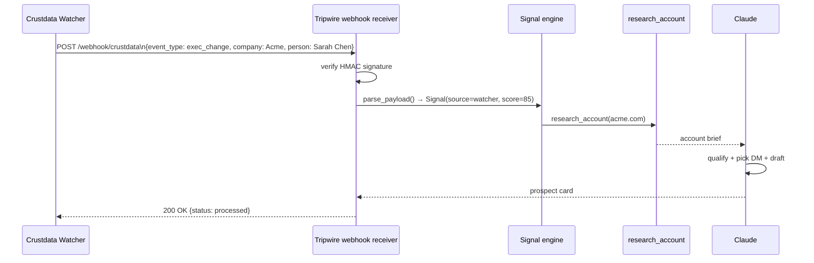
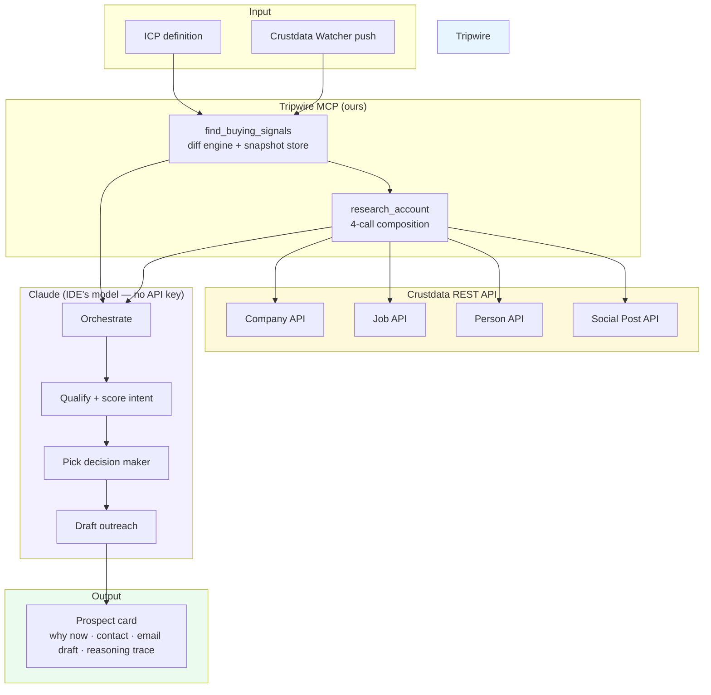

# I built the missing layer on top of Crustdata's API

Crustdata is a real-time B2B data company. Their API gives you live company data, job
postings, people profiles, social posts — all fresh, all queryable. Their pitch is that
they're building "the gateway to the internet for agentic apps."

If you want to drive Crustdata from an AI agent today, you reach for one of the existing
integrations — the community MCP server, or a toolkit like Composio, Zapier, or Merge. They
expose Crustdata's endpoints as agent tools. Every one of them is request/response: search,
enrich, fetch. You ask, it answers.

None of them watch anything.

That gap — between *having* real-time data and *acting on* real-time data — is the entire
problem I spent the last few days solving. The result is **Tripwire**: a signal-driven AI
SDR agent that runs natively inside Claude, built as my own MCP server on Crustdata's REST
API.

---

## The problem with outbound sales

Timing is everything in outbound. The moment a company raises a round, the budget is fresh
and the mandate is real. The moment a new VP of Sales joins, they spend their first 90 days
re-evaluating every vendor. The moment a company opens five sales roles at once, they're
scaling a motion that's about to break on data quality.

These windows are short. Most SDR tools miss them entirely because they work static lists on
fixed cadences — a weekly batch, a monthly refresh, a cron that doesn't know what just
changed.

The data that says *"this company is ready right now"* exists. It just isn't wired to
anything.



The difference isn't the data. It's whether anything is *watching*.

---

## What the existing tooling gives you

The community MCP server for Crustdata is representative of the whole ecosystem. Wire it
into Claude and you get a set of data tools like these:



These are excellent primitives. But they're all pull. You ask, they answer. Nothing
subscribes. Nothing watches. Nothing fires when something changes.

Crustdata's Watcher API *can* push a webhook when a condition fires — that's their real-time
backbone. But none of the agent integrations surface it as a tool. There's no path from "a
condition changed" to "the agent did something." The trigger layer is missing, across the
board.

---

## What Tripwire is

Tripwire is my own MCP server, written directly on Crustdata's REST API, plus a Claude
skill that orchestrates it. I didn't extend anyone else's MCP — I wrote my own so I could
add the one thing the ecosystem lacks.

**The MCP server** exposes the usual data wrappers (search companies, search jobs, search
people, get social posts) — but the two tools that matter are the ones nothing else has:
- `find_buying_signals(icp)` — diffs Crustdata's live data against a stored snapshot,
  returns ranked signals with a score and a *why*. This is the trigger layer.
- `research_account(domain)` — composes four Crustdata calls into one structured brief so
  Claude reasons about the account, not the plumbing.

**The Claude skill** is a playbook that tells Claude how to run the loop: detect → triage →
research → qualify → pick the decision maker → draft outreach tied to the exact trigger.

So the division of credit is honest: Crustdata's API is the eyes — real-time, fresh, theirs.
The reflexes — the signal engine that turns a change in that data into an action — are what
I built.



Blue boxes are Crustdata data calls. Purple boxes are Claude reasoning. The agent decides
what to fetch based on what it finds — that's what makes it agentic rather than a script.

---

## The signal engine

The core of Tripwire is a diff. Every run, it fetches fresh data from Crustdata, compares
it to a snapshot of what it saw last time, and emits a `Signal` for anything that changed.



Three signals from one company in a single diff. Each has a score, a type, and a *why*
that Claude uses to decide the email angle.

---

## How signals are scored

Not all buying signals are equal. The score encodes a thesis about what actually predicts
a deal.



A new VP of Sales is the strongest signal because she brings three things at once: the
authority to buy, a mandate to change the stack, and a finite window to do it (the first 90
days). Funding only unlocks budget. A hiring surge signals scaling pain, but there's no
decision maker attached.

Stacking — when a company fires multiple signals at once — is the agent's job, not the
score's. Each signal is scored independently. Claude sees the cluster and reasons about the
compounding.

---

## The Signal contract

The architectural decision I'm most pleased with: the `Signal` dataclass is the interface
between *how a signal arrives* and *what the agent does with it*.



Today, signals come from a diff. Tomorrow, they come from a real Crustdata Watcher webhook.
The downstream reasoning — Claude researching the account, picking the contact, drafting the
email — doesn't change. `Signal.source` is the only field that differs.

This is what I mean by decoupled. The agent is written against the contract, not the
delivery mechanism.

---

## Signal-aware branching

The skill doesn't treat all signals the same. The email angle is derived from *why* the
company is hot, not just *that* it is.



This is the thing that makes the output unreplicable by a template. A model generating
generic cold email will say "congrats on your Series A" and pivot to a pitch. Naming the
*implication* — the specific problem that event creates right now — requires reasoning over
fresh, multi-source data. Which is the entire Crustdata + Claude thesis.

---

## The real-time path: Watcher webhooks

Phase 5 of the build wires in Crustdata's Watcher API — the true real-time path. Instead
of polling on a schedule, Crustdata pushes a webhook the moment a condition fires.



The webhook receiver (`FastAPI`) parses the payload, validates the signature, maps it to
our `Signal` contract, and hands off to the same research → qualify → draft loop. Nothing
in Claude's reasoning layer knows or cares whether the signal came from a poll or a push.

---

## What the output looks like

```
━━━━━━━━━━━━━━━━━━━━━━━━━━━━━━━━━━━━━━━━━━━━━━
  Acme Corp  ·  120 ppl  ·  B2B SaaS  ·  SF
  Why now (85/100): New VP Sales 1mo ago,
  Series A 3wks ago, 5 open AE roles.
  Contact: Sarah Chen — VP of Sales
  Signals: exec_change(85) · funding(75) · hiring_surge(70)

  > Hi Sarah — saw you joined Acme as VP of Sales
  > 1 month ago, right as the Series A closed and
  > the team started scaling. That 0→1 outbound
  > phase with 5 AEs ramping is exactly when data
  > quality decides whether the motion holds...

  Reasoning: called find_buying_signals → 3-signal
  cluster → research_account confirmed exec_change
  within intent window (tenure 1mo); led with
  exec_change framing.
━━━━━━━━━━━━━━━━━━━━━━━━━━━━━━━━━━━━━━━━━━━━━━
```

The reasoning line is the most important part. It makes the agentic behavior *visible* — a
reviewer can see which tools fired and why the email took the angle it did. It's not a black
box.

---

## Architecture in one diagram



---

## What I'd build next

The agent is one instance of a broader pattern: **signal → research → action**. The signal
and the action are domain-specific (sales here), but the architecture isn't.

The next thing I'd build at Crustdata is a generic "signal → action" framework that other
customers can configure without writing code — point it at a Watcher subscription, describe
the action in plain language, and Claude figures out the rest. The data layer is already
there. The reasoning layer is already there. The missing piece is the configuration surface.

That's the product the tweet is pointing at when it says "you will define and build this
new category of software."

---

## Running it yourself

```bash
git clone https://github.com/kedarvartak/tripwire
cd tripwire
python3 -m venv .venv && source .venv/bin/activate
pip install -r requirements.txt

# Full demo — no keys needed:
rm -f tripwire/fixtures/snapshot_state.json
python -m tripwire.server --demo

# Test suite:
python -m pytest tests/ -v
```

Set `CRUSTDATA_API_TOKEN` to run on live data. Everything else stays the same.

---

*Built in a few days. 67 tests. Zero keys to try.*
*Crustdata's API is the eyes. I built the reflexes.*
