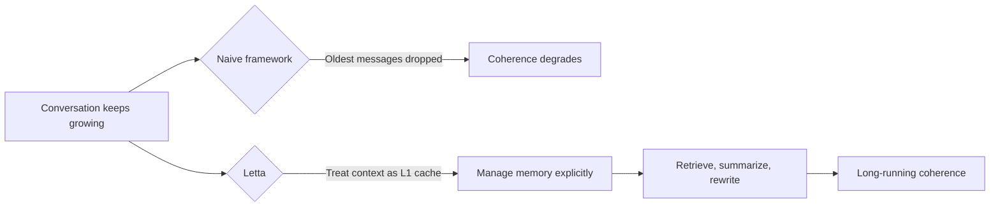
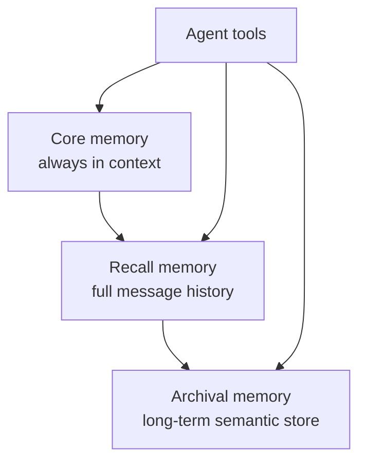

# Letta and the Context Window Problem Nobody Is Solving Correctly

## The Problem

Every LLM has a context window: a fixed amount of tokens it can see at once. When that fills up, something has to go. Most frameworks handle this by truncating. They just drop the oldest messages. Simple, brutal, and it quietly destroys agent coherence over time.

Letta approaches this differently, starting from a more honest framing: the context window is not memory. It's L1 cache.

The field's default response to context limits is to make the window bigger: 128k tokens, 1M tokens, 10M tokens. Letta argues this is the equivalent of buying more RAM instead of inventing virtual memory. You're solving the wrong problem.

## The Memory Hierarchy

Letta, which grew out of the MemGPT research paper, builds a full memory hierarchy modeled on operating systems:

- **Core memory**: always lives in-context. This is what the agent knows right now. It's structured into memory blocks like persona, user info, and custom blocks. Crucially, the agent can edit these itself via tool calls. If a user's preferences change, the agent rewrites its own core memory.
- **Recall memory**: every message ever sent is persisted in a database, even after it's evicted from the context window. The agent can search this via tools. Nothing is deleted, just paged out.
- **Archival memory**: a long-term vector store for facts, documents, and knowledge the agent may need to retrieve later via semantic search.

This three-tier structure means the agent always has a small, high-signal working memory in-context, with the full history retrievable on demand.

## How Compaction Works

When conversations grow long, Letta's compaction system kicks in. Here's the exact pipeline:

1. **75% context usage**: a warning threshold fires, signaling the agent is approaching limits.
2. **90% context usage**: compaction triggers automatically. The sliding window eviction starts, targeting the oldest 30% of messages first, increasing in 10% increments until token usage drops below the limit.
3. **Evicted messages aren't deleted**: they're recursively summarized. Each batch of evicted messages gets summarized together with any prior summaries, so older history has progressively less influence than recent history. The summary lives in-context as a compressed representation of what came before.
4. **Summarizer overflow fallback**: if the summarization itself overflows the context, Letta clamps tool returns to 5,000 characters and retries.
5. **Final fallback**: if it still overflows, it middle-truncates. Keep the first 30% and last 30% of the transcript, drop the middle. The most recent and the foundational context survive.

That's five layers of graceful degradation before an agent loses coherence. Most frameworks have zero. They just cut.

## Self-Compact Mode

One underrated feature: Letta has a self-compact mode where the agent uses its own underlying model to do the summarization. No separate summarizer model, no extra configuration, no additional cost overhead. The same LLM that's running the agent compresses its own history.

## Developer Visibility

A recurring theme in Letta's design is transparency. The framework claims 90% of agent failures trace back to context window issues: things going wrong because the wrong information was in-context at the wrong time.

To address this, Letta exposes a full context window viewer showing exactly what's being sent to the model at any moment, broken into labeled sections:

- Base system instructions
- Tool schemas
- Core memory blocks
- Summarization of compacted history
- Live message buffer

Developers can also set a context budget: a hard token ceiling. When hit, the summarization system kicks in automatically to stay within it while preserving learned knowledge.

## Why This Matters

The difference between Letta's approach and a naive sliding window cut isn't just technical elegance. It's the difference between an agent that stays coherent across thousands of turns and one that slowly forgets who it's talking to.

Mem0 solves memory as a bolt-on layer with automatic extraction. Zep models memory as a temporal knowledge graph. Letta makes the agent itself responsible for managing its own memory: editing, evicting, summarizing, retrieving, using the same tool-calling mechanism it uses for everything else.

It's the most opinionated approach in the space. It's also the most research-grounded, tracing directly back to the MemGPT paper that introduced agentic memory management as a concept.

Whether it's the right choice depends on how much control you want over memory behavior. But if you're building agents that need to stay coherent over long, complex, multi-session interactions, Letta is the only framework thinking about the full hierarchy.
