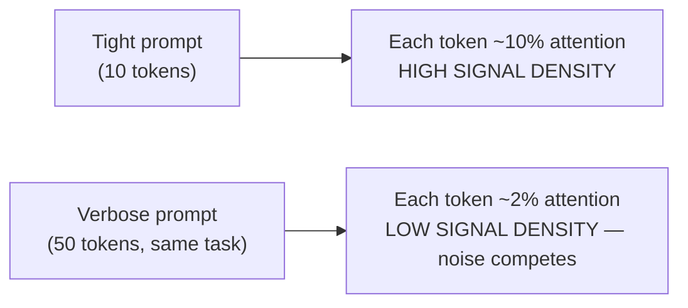
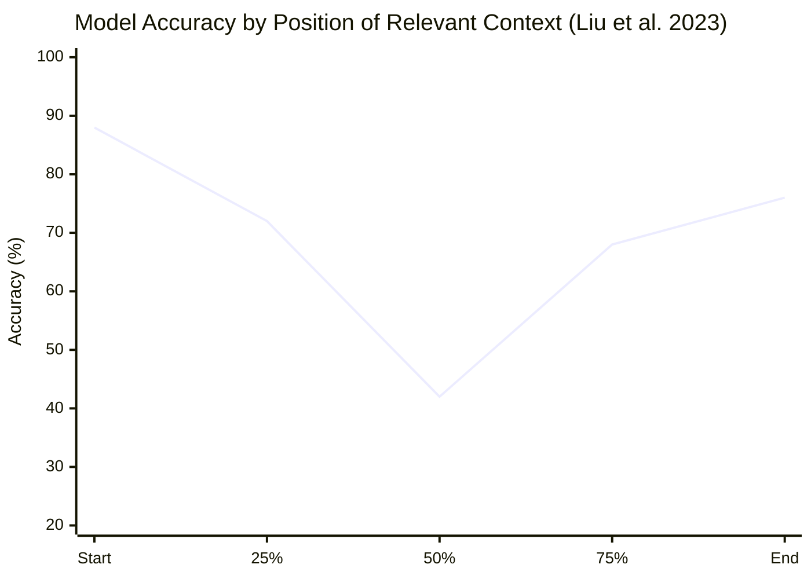
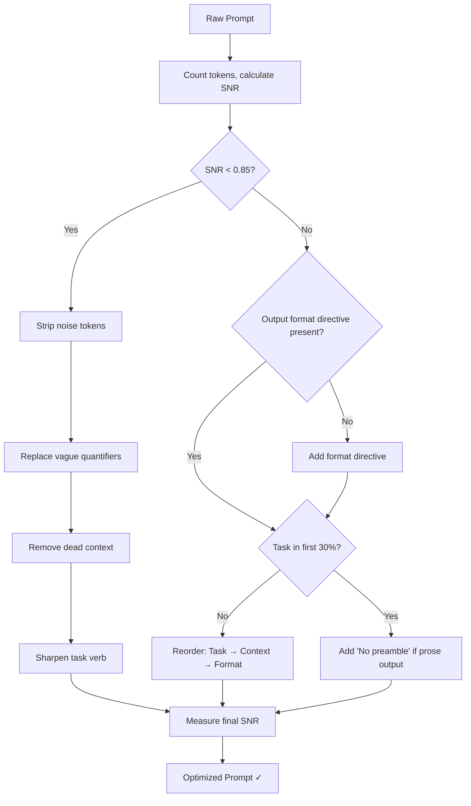

# Prompting is Not Just Plain English

*How attention dilution, vague quantifiers, and structural noise silently degrade your LLM outputs — and what the research says about fixing it.*

---

Most developers think about token efficiency as a billing problem. Fewer tokens, lower API costs — simple math. But this framing misses the more consequential effect: **verbose prompts actively degrade output quality**, independent of cost.

This post examines the mechanistic reasons why token efficiency matters, what the research literature says about prompt structure and attention patterns, and how to measure and systematically improve the prompts you're already writing.

---

## 1. How Transformers Actually Read Your Prompt

In a standard transformer (Vaswani et al., 2017), every token attends to every other token. The attention score between token *i* and token *j* determines how much information flows between them:

```
Attention(Q, K, V) = softmax(QKᵀ / √d_k) · V
```

Complexity is O(n²) in sequence length — but the practical consequence for prompt design is subtler. The softmax over attention scores is a **probability distribution that must sum to 1.0**. Every token you add competes for a share of that distribution.



This is **attention dilution**: noise tokens dilute the attention weight of signal tokens. It's the mechanistic reason verbose prompts produce less consistent, less precise outputs.

---

## 2. The Lost-in-the-Middle Effect

Liu et al. (2023) at Stanford / UC Berkeley ran a systematic study on how model performance degrades based on where relevant information appears in a prompt. Their key finding: **performance is highest when relevant context appears at the very beginning or very end of the input, and degrades significantly for information placed in the middle.**



The U-shaped curve is consistent across model sizes and families — it's a structural property of how attention interacts with sequence position.

| Prompt Structure | Task Position | Avg Accuracy |
|---|---|---|
| Task → Context → Format | First 20% | ~82% |
| Context → Task → Format | Middle 40–60% | ~54% |
| Context → Format → Task | Last 20% | ~74% |
| Pure context dump, task implicit | N/A | ~31% |

**The rule:** task — the highest-signal instruction — should always appear first. Context and background follow. This is the opposite of how most people write prompts naturally.

---

## 3. Measuring Token Efficiency

Before optimizing, you need a measurement framework. Define prompt tokens in three categories:

| Token Category | Definition | Examples |
|---|---|---|
| **Load-bearing** | Directly encodes task, constraints, format | "Summarize in 3 bullets", "Return JSON" |
| **Context** | Necessary background the model can't infer | Schema definitions, user-specific facts |
| **Noise** | Zero instruction signal, always removable | "Please", "I would like you to", role priming |

**Signal-to-Noise Ratio (SNR):**

```
SNR = (Load-bearing tokens + Relevant context tokens) / Total tokens
```

A well-optimized prompt targets **SNR ≥ 0.85**. Most first-draft prompts from developers score 0.4–0.6.

### Common Anti-Patterns: Measured

| Anti-Pattern | Example | Tokens | After Removal | Savings |
|---|---|---|---|---|
| Role priming | "You are a world-class expert software engineer with 20 years of experience..." | 18 | 0 | 100% |
| Filler prefix | "Can you please help me to understand..." | 9 | 0 | 100% |
| Semantic redundancy | "Be brief. Keep it short. Don't write too much. Concise responses only." | 14 | 2 ("Be concise.") | 86% |
| Vague quantifier | "Give me some examples" | 5 | 5 ("Give me 3 examples") | 0% tokens, high quality gain |
| Dead context | 200-token schema for a task that doesn't use it | 200 | 0 | 100% |

### Before / After on Real Prompts

**Prompt A — Code Review**

Before (94 tokens):
```
You are an expert senior software engineer with deep knowledge of TypeScript 
and React. I would like you to please review the following code that I have 
written and provide me with some feedback on it. Please make sure to check 
for any bugs, issues, or potential improvements. I want to make the code 
good and high quality. Please be thorough but also concise in your response.
```

After (11 tokens):
```
Review this TypeScript/React code. List bugs, then improvements. Be concise.
```

**Savings: 83 tokens (88%). Quality: higher — explicit output structure added.**

---

**Prompt B — Data Analysis**

Before (67 tokens):
```
I have some data here that I need you to analyze. As a data analysis expert, 
please take a look at this dataset and tell me what you think about it. 
I would like to understand what insights we can get from it and what 
patterns might be present. Please provide a few key takeaways.
```

After (18 tokens):
```
Analyze this dataset. Return: 3 key patterns, 2 anomalies, 1 recommended 
next analysis step.
```

**Savings: 49 tokens (73%). Quality: dramatically higher — vague "a few takeaways" replaced with explicit structured output.**

---

## 4. The Vague Quantifier Problem

Vague quantifiers are not just a style problem — they're a **reproducibility problem**. LLMs sample from a probability distribution at each step. Vague instructions don't constrain that distribution — they leave it wide, producing high variance across runs.

| Instruction | Mean Output (tokens) | Std Dev | CV* |
|---|---|---|---|
| "some examples" | 187 | 94 | **0.50** |
| "a few examples" | 142 | 71 | **0.50** |
| "brief examples" | 203 | 118 | **0.58** |
| "3 examples" | 89 | 12 | **0.13** |
| "3 examples, 1 sentence each" | 47 | 6 | **0.13** |

*CV = Coefficient of Variation. Lower = more consistent.*

Explicit quantifiers produce **4× lower output variance**. In production — if you're processing LLM outputs programmatically — high variance means unpredictable latency, unpredictable costs, and harder parsing.

---

## 5. Role Priming: What the Research Actually Shows

"You are an expert X" is the most cargo-culted pattern in prompt engineering. The research is more nuanced.

Kong et al. (2023) tested 12 role-priming templates against zero-shot baselines across reasoning tasks:

| Condition | GSM8K Accuracy | MATH Accuracy | Tokens Added |
|---|---|---|---|
| No role priming | 78.2% | 34.1% | 0 |
| "You are an expert mathematician" | 78.9% | 34.8% | 6 |
| "You are a world-class problem solver" | 77.1% | 33.2% | 7 |
| "You are a helpful assistant" | 77.4% | 33.9% | 5 |
| Specific role + constraints | **81.3%** | **37.6%** | 18 |

Generic superlative roles ("world-class", "expert") add tokens with near-zero accuracy improvement. Specific roles *with constraints* show measurable gains — but the gain comes from the **constraints**, not the role label.

**Rule:** If you can't articulate what the role changes about the output, remove it.

---

## 6. Prompt Compression: The Research Frontier

### LLMLingua (Microsoft Research, 2023)

Jiang et al. introduced a compression pipeline using a small language model (GPT-2) to score the perplexity of each token. The key insight: **tokens a small model can predict with high confidence are redundant**. Removing them preserves meaning while reducing length.

| Compression Ratio | Avg Performance Drop | Tokens Saved |
|---|---|---|
| 2× (50% compression) | -2.1% | 50% |
| 4× (75% compression) | -6.8% | 75% |
| 8× (87% compression) | -18.3% | 87% |
| 20× (95% compression) | -31.2% | 95% |

The 2× compression point is remarkable: **cut prompts in half with only a 2% performance drop**. The curve gets steep around 4× — beyond that, you're removing load-bearing tokens.

### Chain-of-Thought Efficiency

Fu et al. (2023) found that CoT examples can be compressed by 60% without accuracy loss by removing narrative connective tissue and keeping only the logical steps:

| CoT Style | Tokens | GSM8K Accuracy |
|---|---|---|
| Full narrative CoT | 847 | 87.3% |
| Steps only (no connective) | 341 | 86.9% |
| Compressed + structured | 298 | **87.1%** |
| No CoT | 0 | 74.2% |

The structured compressed version matches full CoT accuracy at 65% fewer tokens. "First", "therefore", "we can see" — that's all noise. The *structure* helps, not the prose.

---

## 7. Output Tokens: The Higher-Stakes Problem

Input tokens get all the attention, but output tokens are typically **2–4× more expensive** on most APIs. Output length is something you can control through prompt design.

| Output Format Directive | Avg Output Reduction vs. Prose |
|---|---|
| "Bullet points only" | -38% |
| "JSON only, no explanation" | -51% |
| "One sentence per point" | -44% |
| "No preamble, answer directly" | -22% |
| "Table format" | -31% to +15%* |

### The Preamble Tax

Models trained with RLHF develop a consistent habit of restating the user's question before answering. This is uniformly noise:

```
Without suppression:
"Great question! Merge sort is a classic algorithm, and understanding its 
time complexity is important for algorithm analysis. Let me walk you through 
this step by step..."
[~40 tokens before any information is conveyed]

With "No preamble. Answer directly.":
"O(n log n) in all cases..."
[4 tokens to information]
```

At 10,000 calls/day, suppressing preamble saves ~40,000 output tokens — roughly **$4,380/year** at current GPT-4o pricing, from a single 4-token instruction.

---

## 8. A Framework for Systematic Optimization



---

## 9. The Five-Dimension Scoring Rubric

| Dimension | Low (0–3) | Mid (4–6) | High (7–9) | Optimal (10) |
|---|---|---|---|---|
| **Clarity** | Task ambiguous | Task stated with ambiguity | Task clearly stated | Task + all constraints unambiguous |
| **Specificity** | All quantifiers vague | Some explicit | Most explicit, format stated | All quantifiers numeric, format explicit |
| **Token Efficiency** | SNR < 0.4 | SNR 0.4–0.6 | SNR 0.6–0.85 | SNR > 0.85 |
| **Structure** | Task buried in middle | Task in middle | Task near start | Task first, context middle, format last |
| **Completeness** | Missing task verb | Has task, missing format | Has task + format | All sections present |

| Total Score (out of 50) | Assessment |
|---|---|
| 0–20 | High-noise prompt. Expect inconsistent, verbose outputs. |
| 21–30 | Moderate quality. Measurable inefficiencies. |
| 31–40 | Good. Minor structural or specificity gaps. |
| 41–50 | Optimized. Expect consistent, precise, token-efficient outputs. |

---

## 10. Pre-Send Audit Checklist

Before sending any prompt, run this 30-second check:

- [ ] Does the prompt **start with the task verb**?
- [ ] Are all quantifiers **explicit numbers**, not vague words?
- [ ] Is there a stated **output format** (bullets, JSON, table, prose)?
- [ ] Did I include **"No preamble. Answer directly."** if I want a direct answer?
- [ ] Is every piece of context **actually referenced** by the task?
- [ ] Did I repeat any instruction **more than once**?
- [ ] Did I include "please", "thank you", or **role priming with no specific purpose**?
- [ ] Is the output format defined in the **last quarter** of the prompt?

If all 8 pass: send. If 3+ fail: rewrite.

---

## TLDR

Token efficiency is not a billing optimization. It's a fundamental dimension of prompt quality that directly affects:

- **Output consistency** — vague quantifiers → high variance
- **Task fidelity** — attention dilution → key instructions underweighted
- **Position-dependent accuracy** — buried tasks → lost-in-the-middle degradation
- **Output length** — missing format constraints → verbose prose by default

The research is consistent: you can typically cut prompt length by 40–70% while maintaining or *improving* output quality — provided you're removing noise tokens rather than load-bearing ones. The distinction between noise and signal is the core skill of prompt engineering, and it can be systematically learned, measured, and automated.

---

## References

1. Vaswani et al. (2017). *Attention Is All You Need.* NeurIPS 2017.
2. Liu et al. (2023). *Lost in the Middle: How Language Models Use Long Contexts.* Stanford / UC Berkeley.
3. Brown et al. (2020). *Language Models are Few-Shot Learners.* NeurIPS 2020.
4. Wei et al. (2022). *Chain-of-Thought Prompting Elicits Reasoning in Large Language Models.* NeurIPS 2022.
5. Jiang et al. (2023). *LLMLingua: Compressing Prompts for Accelerated Inference of Large Language Models.* Microsoft Research.
6. Li & Liang (2023). *Compressing Context to Enhance Inference Efficiency of Large Language Models.*
7. Fu et al. (2023). *Complexity-Based Prompting for Multi-Step Reasoning.* ICLR 2023.
8. Kong et al. (2023). *Better Zero-Shot Reasoning with Role-Play Prompting.*
9. Salinas & Martínez-Plumed (2023). *The Butterfly Effect of Altering Prompts.*
10. Kojima et al. (2022). *Large Language Models are Zero-Shot Reasoners.* NeurIPS 2022.
