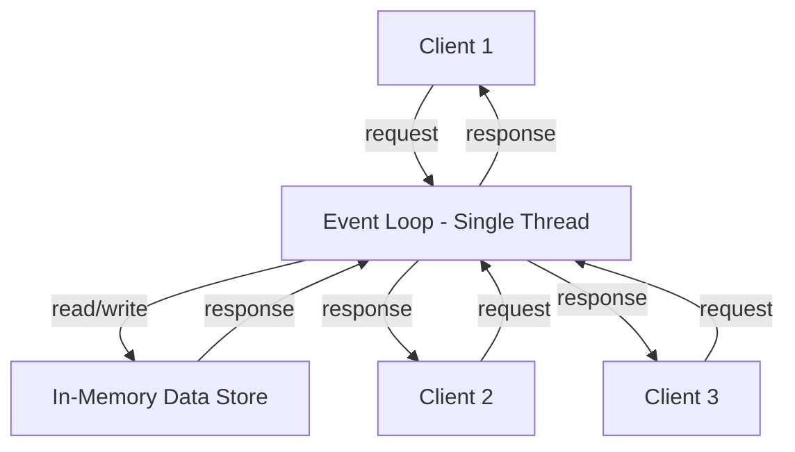
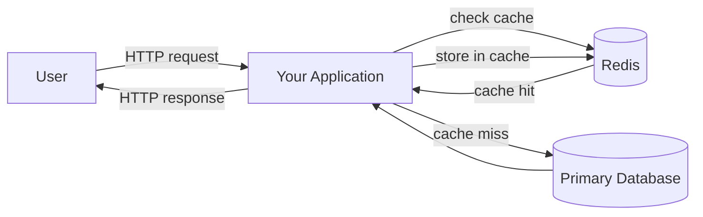
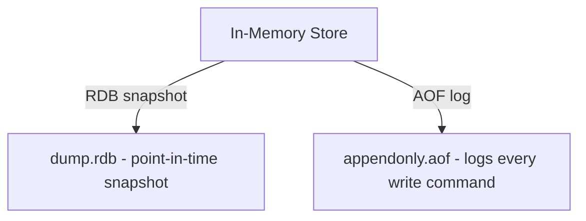
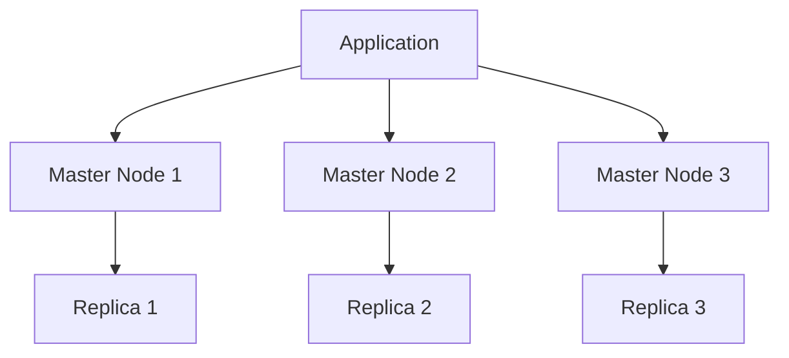

> note: this blog is also for someone who heard redis first time in his life.

Redis stands for **Remote Dictionary Server**.

## Why is Redis so fast?

Read the below table carefully —

![[redis-from-first-principles-1781698971381.webp]]

As you can see, the time it takes to read data from disk vs from RAM (cache) is night and day. RAM is blazingly fast — we're talking nanoseconds vs milliseconds. Redis is an **in-memory store**, meaning it keeps all data in RAM, which is why it feels almost instant.

But there's a catch. RAM is **volatile** — meaning if the power goes off, or the server restarts, the data is gone. That's why Redis is typically used for **temporary data**, not as your primary source of truth.

Think of it like your work desk vs a filing cabinet. Your desk (RAM) is fast to access, but you clear it at the end of the day. The filing cabinet (disk) is slower but permanent.

## What is Redis actually used for?

![[redis-from-first-principles-1781698985235.webp]]

Redis isn't a one-trick pony. Here are the most common use cases:

- **Caching** — Store the result of expensive database queries so you don't have to recompute them every time. A user's profile page? Fetch once, cache it in Redis, serve instantly for the next 10 minutes.
- **Session Store** — When you log into a website, your session (who you are, what you're allowed to do) is often stored in Redis. Fast reads, short-lived data — perfect fit.
- **OTP Store** — That 6-digit code you get on your phone? It lives in Redis with a 5-minute expiry. After that, it's automatically deleted.
- **Rate Limiting** — "You've made too many requests, try again later." Redis tracks how many times an IP has hit an endpoint in the last 60 seconds and blocks if it crosses the limit.
- **Job Queue / Message Broker** — Redis can act as a queue where producers push tasks and workers pull and process them. We've explored this before with Bull/BullMQ.

## So what exactly *is* Redis?

There are several opinions floating around — people call it a database, a hashmap, a key-value store, an in-memory database. Some folks even use it as their primary database (which, honestly... why?).

Here's the clearest way to think about it:

> Redis is a **key-value store** that lives in memory, with optional persistence to disk, and supports rich data structures beyond just strings.

That last part matters. Redis isn't just `key → string`. It supports:

| Data Structure | Example Use |
|---|---|
| String | Caching a user's name |
| List | Activity feed, message queue |
| Set | Unique visitors, tags |
| Sorted Set | Leaderboards, priority queues |
| Hash | Storing a user object (field → value) |
| Bitmap | Feature flags per user |
| HyperLogLog | Approximate unique count at scale |

So calling it "just a hashmap" undersells it. And calling it "a database" overstates it — you wouldn't store your entire users table in Redis.

The sweet spot: **Redis is a fast, temporary, structured data layer that sits between your application and your primary database.**

## Architecture of Redis

Redis follows a beautifully simple architecture. Let's break it down.

### Single-threaded event loop

Redis processes commands using a **single thread**. No locks, no race conditions, no context switching overhead. It uses an event loop (similar to Node.js) to handle thousands of concurrent connections efficiently.

Because everything is in RAM and single-threaded, there's no waiting around. Commands execute in **microseconds**.

### How your app talks to Redis

This is the classic **cache-aside pattern**:
1. Request comes in
2. Check Redis first
3. If data is there (cache hit) → return immediately
4. If not (cache miss) → query the DB, store result in Redis, return

### Persistence (yes, Redis can save to disk too)

Even though Redis is in-memory, it has two ways to persist data to disk so you don't lose everything on a restart:

- **RDB (Redis Database Backup)** : Takes a snapshot of all data at set intervals. Fast to restore, but you might lose a few minutes of data if the server crashes.
- **AOF (Append Only File)** : Logs every single write command. Slower but much safer. On restart, Redis just replays the log.

Most production setups use **both** together.

### Redis in a distributed setup

For large-scale systems, Redis can be run in cluster mode across multiple nodes:

Data is split (sharded) across master nodes. Each master has one or more replicas for failover. If a master goes down, a replica is promoted automatically.

## Quick summary

| Question | Answer |
|---|---|
| What is Redis? | An in-memory key-value store |
| Why is it fast? | Because RAM >> Disk |
| Is it a database? | Not really — it's a caching/temporary data layer |
| Is data permanent? | By default no, but RDB/AOF persistence is available |
| What can it store? | Strings, Lists, Sets, Sorted Sets, Hashes, and more |
| Common use cases | Cache, Sessions, OTPs, Rate limiting, Job queues |

---

## References

- System Design Interview – An Insider's Guide, Alex Xu
- [Redis Official Documentation](https://redis.io/docs/)
- [Redis Data Structures](https://redis.io/docs/data-types/)